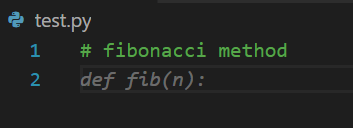
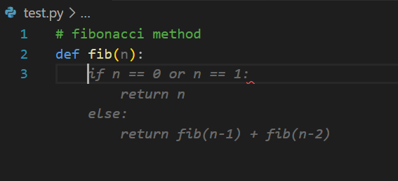
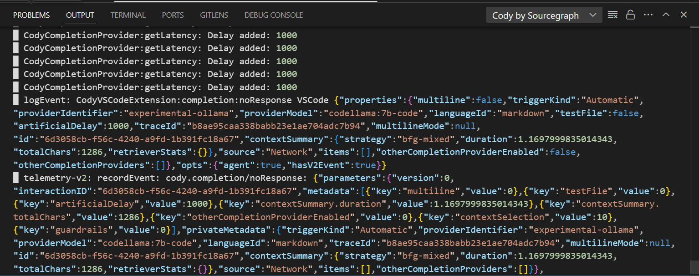

# Local-Coding-Assistant
Building a Local Coding Assistant with Code Llama and Cody

## Getting up to speed
* If you are just starting out with local LLMs, refer to my guide on setting up your own local LLM using Ollama here: https://github.com/Akshay-Dongare/Ollama-Local-LLM
## Pulling CodeLlama
* Open cmd and run: `ollama pull codellama:7b-code`
* Note: codellama is a LLM finetuned for coding domain
## Integration with Visual Studio Code and Cody AI
* To get your own personal, free, local and accurate coding assistant going, follow these steps
  1. Open Visual Studio Code
  2. Go to extensions tab: `ctrl+shift+x`
  3. Install Cody AI by Sourcegraph extension and enable it globally
  4. Navigate to the Cody extension settings by pressing `ctrl+shift+p` and typing "Cody:Extension Settings"
  5. Navigate to `Cody › Autocomplete › Advanced: Provider` and select `experimental-ollama`
  6. Navigate to `Cody › Autocomplete › Advanced: Server Endpoint` and type `http://localhost:11434`
  7. Your local coding assistant is up and running!

## Demo
* To check it's performance, make a new python file and type `#fibonacci method` and codellama:7b-code will start auto-completing the code for you!
* Example: 
*  
* 
* To check logs, go to `Console>Output` and select `Cody by Sourcegraph`
* You should see something similar to: 
* 
## Integration with Visual Studio Code and Continue
1. To use local models with Continue and VS code, first Open Visual Studio Code
2. Go to extensions tab: `ctrl+shift+x`
3. Install `Continue - CodeLlama, GPT-4, and more` extension and enable it globally
4. Open the `Continue` extension window
5. Open model selection menu on bottom left, here you can see all the freely available models for trial
6. Click the `+` icon, this will take you to `Add new model` menu
7. Select Ollama
8. This will take you to `Configure Model` menu
9. Select `Autodetect`
10. This will add all the models you have on your system that you have installed using `ollama pull {model_name}` to `Continue`
11. To recheck this, open the `config.json` file by clicking on the settings icon in `Continue` extension and check whether the following has been added to `"models"` list automatically: 
```
{
      "model": "AUTODETECT",
      "title": "Ollama",
      "completionOptions": {},
      "apiBase": "http://localhost:11434",
      "provider": "ollama"
}
```
12. Now all your local models will be available within `Continue` interface and you can use them to chat with your code
13. This way, even the custom models you have created using ModelFile/System Prompt editing (via `ollama create {custom_model_name} --file {path_to_modelfile}`) will also be available in `Continue`!

## Sources
* https://sourcegraph.com/blog/local-code-completion-with-ollama-and-cody
* [FINALLY! Open-Source "LLaMA Code" Coding Assistant (Tutorial)](https://www.youtube.com/watch?v=gY_E3QBZ-NE&t=1s&ab_channel=MatthewBerman)
